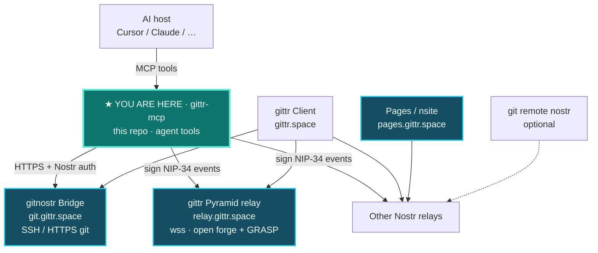

# gittr-mcp

<!-- mcp-name: io.github.arbadacarbaYK/gittr-mcp -->

**Let your AI agent (or app) use [gittr.space](https://gittr.space) like a developer would** — create repos, push code, open and merge pull requests, manage issues, and work with Lightning bounties — using your **Nostr identity**, not a GitHub login.

Works with **Cursor**, **Claude Desktop**, **VS Code / Copilot MCP**, **Windsurf**, **OpenClaw**, or any host that speaks the [Model Context Protocol](https://modelcontextprotocol.io/) over stdio.

---

## Why use this?

| Without gittr-mcp | With gittr-mcp |
|-------------------|----------------|
| You copy-paste between chat and the gittr website | The agent calls tools: push files, publish repo metadata, open issues/PRs |
| Custom scripts for NIP-98 bridge auth and NIP-34 signing | Signing, challenge handling, and relay checks are built in |
| Unclear whether a push “really” landed on Nostr | Tools return pass/fail plus `verification` / `nextSteps` for automation |

**End result:** one MCP server connects your agent to **decentralized git on Nostr** — same account as on gittr.space (`nsec` / keys file), no separate vendor account for the agent.

## Where this sits (platform map)

gittr-mcp is the **agent door** into the same platform humans use in the browser. **You are here = gittr-mcp** (this repo, teal). Cyan-outlined host boxes = public hostnames (`git.` / `pages.` / `relay.gittr.space`) (teal = this repo; cyan outline = host URLs).



| Piece | Host / link | How MCP uses it |
| --- | --- | --- |
| **gittr Client** | [gittr on gittr.space](https://gittr.space/npub1n2ph08n4pqz4d3jk6n2p35p2f4ldhc5g5tu7dhftfpueajf4rpxqfjhzmc/gittr?branch=main) · `gittr.space` | Same product; MCP mirrors forge actions (repos, issues, PRs, bounties) |
| **gitnostr Bridge** | [gitnostr on gittr.space](https://gittr.space/npub1n2ph08n4pqz4d3jk6n2p35p2f4ldhc5g5tu7dhftfpueajf4rpxqfjhzmc/gitnostr?branch=main) · **`git.gittr.space`** | `pushToBridge`, file list, merge clones over HTTPS |
| **Pages / nsite** | [nsite-gateway](https://gittr.space/npub1n2ph08n4pqz4d3jk6n2p35p2f4ldhc5g5tu7dhftfpueajf4rpxqfjhzmc/nsite-gateway) · **`pages.gittr.space`** | Out of band for most MCP git tools |
| **gittr Pyramid relay** | [pyramid](https://gittr.space/npub1n2ph08n4pqz4d3jk6n2p35p2f4ldhc5g5tu7dhftfpueajf4rpxqfjhzmc/pyramid) · **`relay.gittr.space`** | Prefer in relay lists when publishing NIP-34 |
| **★ gittr-mcp (this README)** | [gittr-mcp on gittr.space](https://gittr.space/npub1n2ph08n4pqz4d3jk6n2p35p2f4ldhc5g5tu7dhftfpueajf4rpxqfjhzmc/gittr-mcp) | **You are here** |
| **git remote nostr** | [ngit-cli](https://github.com/DanConwayDev/ngit-cli) | Not required for MCP; agents usually use bridge HTTPS + events |

**Addressing for agents:** `resolveRepoByNostrId(npub|hex, repo)` → `cloneUrl` + relays. Prefer announced **npub**-path HTTPS on **`git.gittr.space`** (NIP-34); hex path is a disk fallback if a symlink is missing. Include **`wss://relay.gittr.space`** when publishing.

---

## What you can do (workflows)

These are the **processes** people actually run; each maps to MCP tools the agent can call.

### Ship a new project
1. **`createRepo`** — push initial files to the bridge **and** publish Nostr kinds **30617** + **30618** in one step (best default for agents).  
   Pass **`publicRead: false`** to create a **private** repo (code/clone/API/SSH readable only by you and listed maintainers). The announcement name/description still appear on relays — only file access is gated.  
2. Or step-by-step: **`pushToBridge`** → **`publishRepoAnnouncement`** → **`publishRepoState`**.

### Private repositories
- Set **`publicRead: false`** on **`createRepo`**, **`publishRepoAnnouncement`**, **`forkRepo`**, or **`mirrorRepo`**.
- Private repos are **hidden from Explore/home/profile listings** for strangers.
- **Direct URL** still shows the repo name with a **Private** badge; unauthorized viewers see a lock screen (no code).
- **SSH / CLI / API reads** use the same ACL as the web UI: your **npub** must be owner or maintainer (`addCollaborator` or Settings → Contributors on gittr.space).
- **SSH key registration** is unchanged — keys identify *you*; private repos only check whether *your pubkey* has read permission.

### Day-to-day development
- **`pushToBridge`** — update files on a branch (NIP-98 auth to gittr bridge).  
- **`getFile`**, **`bridgeListFiles`**, **`bridgeGetFileContent`**, **`getBranches`**, **`getCommitHistory`** — read repo state without cloning. (`getFile` ≈ bridge + a few GRASP raw URLs; for Code-tab parity see [MCP-GITTR-PARITY.md](docs/MCP-GITTR-PARITY.md) and gittr FILE_FETCHING_INSIGHTS.)
- **`resolveRepoByNostrId`** — find clone URLs and relays from npub + repo name.

### Issues (bug reports, tasks)
- **`listIssues`**, **`createIssue`**, **`getIssueById`**  
- **`closeIssue`**, **`reopenIssue`** — publish NIP-34 status events (1632 / 1630).

### Pull requests (code review flow)
| Step | Tool | Notes |
|------|------|--------|
| List / open PR | **`listPRs`**, **`createPR`** | Signed Nostr events (kind **1618**). |
| Full PR with git branches | **`createPRViaGittrCLI`** | Recommended when the agent has **`git`** on PATH. |
| Update PR tip | **`updatePullRequest`** | New commit + clone URLs on the PR event. |
| Merge into `main` | **`mergePullRequest`** | **Real git merge**: clone/fetch, merge, push bridge, publish **30618** + merged status **1631**. Repo owner or listed maintainer; **`git` required**. |
| Mark merged (Nostr only) | **`markPullRequestMerged`** | Status only — no git merge. |

**Honest limits on PRs:** Creating and listing PRs via MCP is supported. **Merging** needs **`git`** installed and permission on the repo. Some relays are strict about **clone URL + relay** matching in repo announcements — if PR publish fails, fix metadata (see [Limitations](#limitations-prs--clone-urls)) or use **`createPRViaGittrCLI`**. Details: [docs/DEVELOPER.md#limitations](docs/DEVELOPER.md#limitations).

### Fork, mirror, import
- **`forkRepo`** — fork an existing gittr repo under your key.  
- **`mirrorRepo`** — copy from GitHub/GitLab URL to gittr.  
- **`importRemoteToBridge`** — server-side import/refetch into bridge storage.

### Discover & social
- **`listRepos`**, **`searchRepos`**, **`myRepos`**, **`exploreRepos`**, **`getTrendingRepos`** (trending = recent repos, not engagement rank)  
- **`starRepo`**, **`unstarRepo`**, **`listStars`** — NIP-25 on the repo’s **30617** event (same as gittr Star button).  
- **`watchRepo`**, **`unwatchRepo`**, **`listWatchedRepos`** — NIP-51 kind **10018** followed-repo list (same as gittr Watch).  
- **`getRepoContributors`**

**Parity details:** [docs/MCP-GITTR-PARITY.md](docs/MCP-GITTR-PARITY.md) — what matches gittr.space vs caveats.

### Releases & tags
- **`listReleases`** — git **tags** from bridge (`refs/tags/*`), not the web UI “Releases” notes.  
- **`createRelease`** — returns guidance only (UI release notes until next **30617** push).  
- **`fetchForgeReleases`** — latest public forge Release + APKs (`hash:true` for sha256).  
- **`announceSoftwareFromForgeRelease`** — Zapstore/NIP-82 announce (kinds **32267** / **30063** / **3063**) from a forge Release APK (same as Code sidebar **Announce app**).  
- **`deleteSoftwareAnnounce`** — NIP-09 kind **5** for those app/release/asset event ids.

### Lightning bounties & pay-to-push
- Bounties: **`listBounties`**, **`createBountyInvoice`**, **`publishBountyToNostr`**, **`submitBounty`**, **`listBountiesForIssue`**, release/withdraw tools.  
- Paywall: **`getPushPaywallStatus`**, **`createPushPaywallIntent`**, **`syncRepoPushPolicy`**.  
- Optional LNbits: set **`GITTR_LNBITS_URL`** and **`GITTR_LNBITS_ADMIN_KEY`** in MCP env (see `.env.example`).

### Session / keys
- **`describeAgentAuth`** — run once: confirms keys load (never returns `nsec`); if unconfigured it tells the agent to ask you about a test keypair.  
- **`setupTestKeypair`** — after your explicit OK, writes a disposable test identity to `.nostr-keys.json` (replace with your real `nsec` anytime).  
- **`loadCredentials`**, **`getPublicKey`** — debugging helpers.

**Full tool list:** 50+ tools in `server.js` (search for `name:`). Library API: [docs/DEVELOPER.md](docs/DEVELOPER.md).

---

## Install (5 minutes)

### Requirements
- **Node.js 18+**
- A **Nostr private key** (`nsec` or hex) — same identity you use on gittr.space

### 1. Get the server

**Clone (developers / Cursor):**

```bash
git clone https://github.com/arbadacarbaYK/gittr-mcp.git
cd gittr-mcp
npm install
```

**Claude Desktop one-click (`.mcpb`):** download the latest bundle from [GitHub Releases](https://github.com/arbadacarbaYK/gittr-mcp/releases) (`gittr-mcp-x.y.z.mcpb`). New releases are built automatically when we push a `v*` tag — see [docs/RELEASE.md](docs/RELEASE.md).

### 2. Add your key (local only, never commit)

```bash
cp .nostr-keys.json.example .nostr-keys.json
```

Edit `.nostr-keys.json` and set your **`nsec`** (or hex `secretKey`). The file is gitignored.

Lookup order: `./.nostr-keys.json` → `~/.nostr-identity.json` → `~/.config/gittr/keys.json`.

**No key yet? Test keypair flow.** If no credentials are found, `describeAgentAuth` and all key-missing errors tell the agent to ask you whether a disposable **test keypair** should be created. If you agree, the agent calls **`setupTestKeypair({ confirm: true })`** — it writes a fresh identity into `.nostr-keys.json` (flagged `"generated": true`, file mode 600, never committed) and everything auto-loads it from then on. Replace the `nsec` in that file with your real key whenever you're ready; `describeAgentAuth` keeps reminding the agent that a test key is active. It never runs without `confirm: true` and never overwrites existing credentials unless you explicitly ask for `force: true` — anything published under a keypair stays under that identity forever, so this is always your call, not the agent's.

### 3. Wire up your MCP host

**Important:** **Add** a new server entry — do **not** replace your entire MCP config.

#### Cursor

Edit `~/.cursor/mcp.json` (or project MCP settings). Use an **absolute** path:

```json
{
  "mcpServers": {
    "gittr": {
      "command": "node",
      "args": ["/ABSOLUTE/PATH/TO/gittr-mcp/server.js"],
      "env": {
        "BRIDGE_URL": "https://gittr.space"
      }
    }
  }
}
```

Reload MCP or restart Cursor.

#### Claude Desktop

Quit Claude, edit `claude_desktop_config.json` (path depends on OS — see Anthropic docs), same `mcpServers` block as above, restart.

#### VS Code / Copilot, Windsurf, OpenClaw, custom apps

Same stdio contract: `command`: `node`, `args`: `["/path/to/server.js"]`, optional `env`.  
OpenClaw / mcporter: [docs/MCP-HOSTS.md](docs/MCP-HOSTS.md).

#### Embed as a library (no MCP)

```javascript
const gittr = require('gittr-mcp');
await gittr.pushToBridge({ /* ... */ });
```

Entry point: `index.js`. MCP process: `server.js` (npm bin **`gittr-mcp`**).

### 4. Verify

In chat, ask the agent to call **`describeAgentAuth`**, or from the repo:

```bash
npm test
```

---

## What to ask your agent

Examples that map to the workflows above:

- “Create a repo `my-demo` with a README and publish it on gittr.”  
- “Push these file changes to `my-demo` on `main`.”  
- “Open an issue: login button broken.”  
- “List open PRs on npub…/my-demo and merge PR `<id>` if I’m the owner.”  
- “Mirror `https://github.com/user/repo` to gittr as `repo-name`.”

Agents should read tool results as JSON; many responses include **`agentSummary`** and **`nextSteps`**.

---

## Limitations (PRs & clone URLs)

Short version — full detail in [docs/DEVELOPER.md](docs/DEVELOPER.md):

1. **Bridge push** and **Nostr publish** are separate steps unless you use **`createRepo`**. Pushing alone does not make the repo visible everywhere.  
2. **`git clone`** only “works” for others if your published **`clone`** URL serves git HTTP. This MCP defaults toward **`https://git.gittr.space/<hex-pubkey>/<repo>.git`**. A failed clone means fix the URL in **30617**, not “ignore and continue.” Host-only values like `https://git.gittr.space` are rejected/expanded on publish.  
3. **`mergePullRequest`** needs **`git`** on the machine running MCP and maintainer/owner rights.  
4. Relays can rate-limit or lag; failed verification is a **failed** publish, not “maybe OK.”

### Do MCP users get gittr’s filter / CORS server fixes?

**Mostly yes, without updating MCP.** Browser/`filter`/`uploadpack`/CORS fixes live on **`git.gittr.space`**. Anyone (including agents via MCP) cloning that host benefits as soon as the server is fixed.

**MCP package updates are separate.** Cursor/Claude do **not** auto-pull new MCP code. To get new tools or clone-tag logic:

- **git clone install:** `cd gittr-mcp && git pull && npm install`, then reload MCP / restart the host  
- **Claude `.mcpb`:** download the latest from [Releases](https://github.com/arbadacarbaYK/gittr-mcp/releases) and reinstall the bundle

---

## For developers

```bash
npm ci
npm test
# Live tests (real relays; optional LNbits) — see .env.example
GITTR_TEST_NSEC=nsec1... npm run test:live:matrix
```

| Doc | Contents |
|-----|----------|
| [docs/MCP-HOSTS.md](docs/MCP-HOSTS.md) | Per-host MCP config |
| [docs/AGENT-WORKFLOW.md](docs/AGENT-WORKFLOW.md) | Step-by-step push + publish |
| [docs/AGENT-QUICKSTART.md](docs/AGENT-QUICKSTART.md) | Copy-paste agent prompts |
| [docs/DEVELOPER.md](docs/DEVELOPER.md) | API, verification contract, GRASP |
| [docs/SIGNING-GUIDE.md](docs/SIGNING-GUIDE.md) | Keys and NIP-98 |
| [docs/NIP34-SCHEMAS.md](docs/NIP34-SCHEMAS.md) | Event kinds |
| [docs/MCP-GITTR-PARITY.md](docs/MCP-GITTR-PARITY.md) | MCP vs gittr.space feature map |

---

## Security

- Do **not** commit `.nostr-keys.json`, `.env`, or real `nsec` values.  
- Bridge auth uses **NIP-98**; treat agent transcripts as sensitive.  
- Only **`.nostr-keys.json.example`** belongs in git.

---

## Links

- **This repo:** https://github.com/arbadacarbaYK/gittr-mcp  
- **gittr.space:** https://gittr.space  
- **NIP-34 (git on Nostr):** https://github.com/nostr-protocol/nips/blob/master/34.md  

MIT License.
